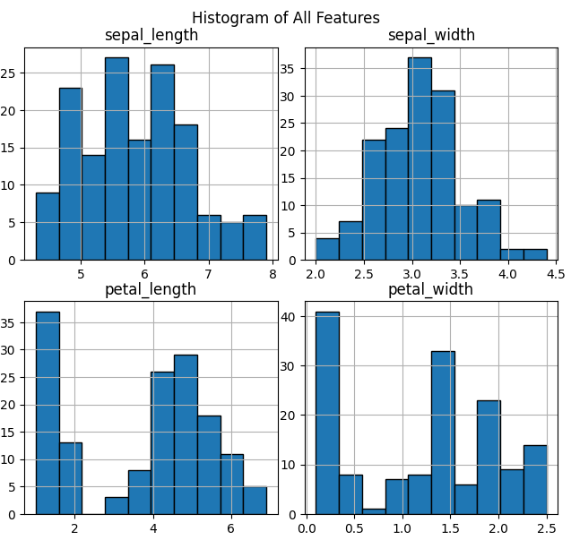
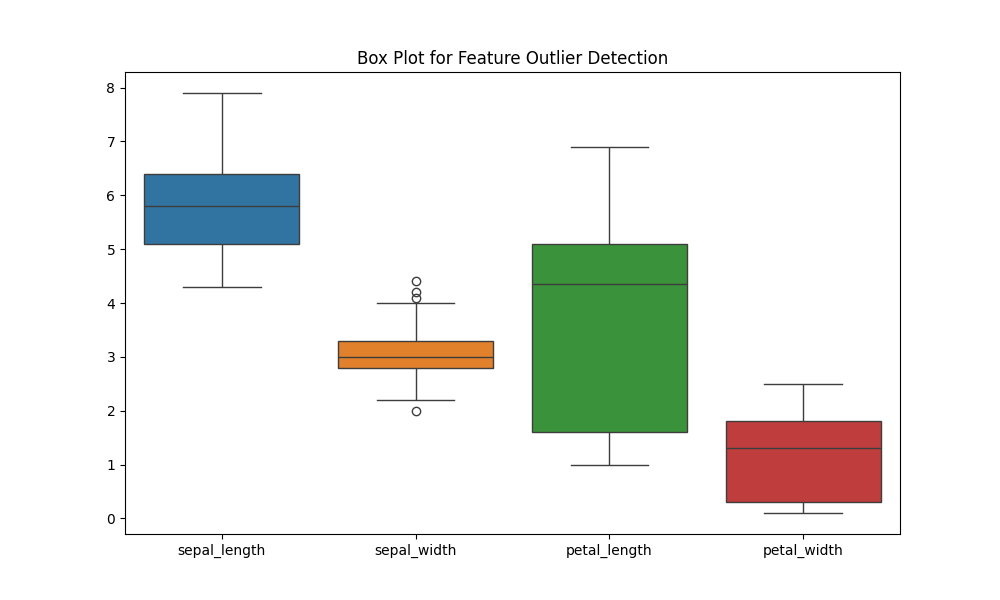
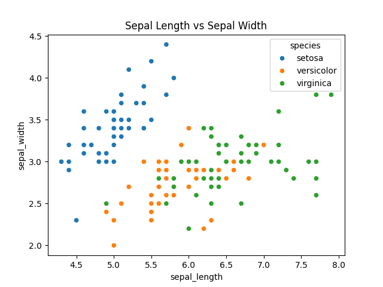

# Iris Data Explorer 🌸

## Overview
EDA of Fisher's Iris dataset with visual classification analysis.

## Key Visuals
| Visualization | Insights |
|--------------|----------|
|  | Setosa shows distinct sepal ratios |
|  | Petal length perfectly separates species |
|  | 3 potential measurement anomalies |

## Features Analyzed
- Sepal length/width
- Petal length/width 
- Species classification

## Tech Used
- Python 3
- Pandas (Data handling)
- Matplotlib/Seaborn (Visualization)
- Scikit-learn (Data loading)

## Insights
- Petal metrics > sepal metrics for classification
- Setosa most distinct (100% separable)
- Virginica shows widest natural variation
