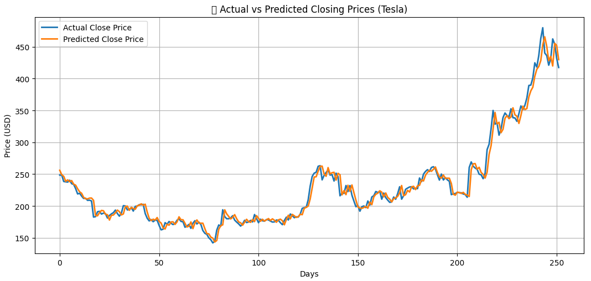

# TSLA Stock Predictor 📈

## Overview
Linear regression model predicting Tesla's next-day closing price using historical market data.

## Key Results
| Visualization | Insights |
|--------------|----------|
|  | Model tracks trend but lags on volatility |

## Data Pipeline
1. **Source**: Yahoo Finance API (OHLCV data)
2. **Features**: Historical closing prices
3. **Target**: Next-day close price

## Model Specs
- **Algorithm**: Linear Regression
- **Metric**: RMSE = % of avg price
- **Lookback**: X trading days
