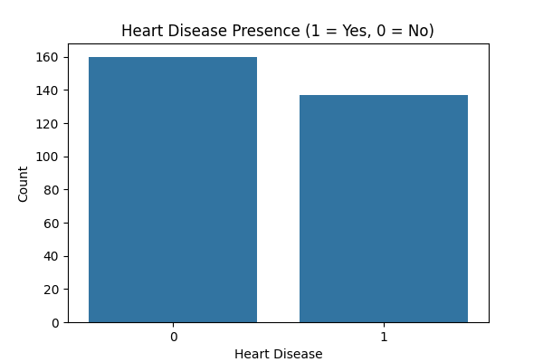
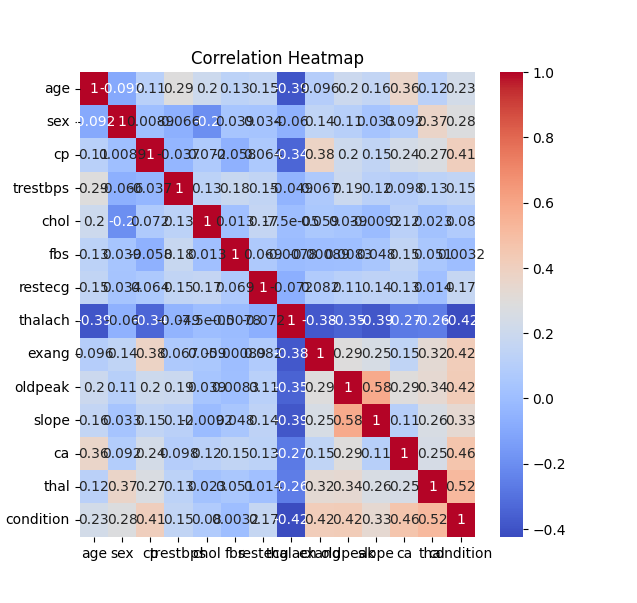
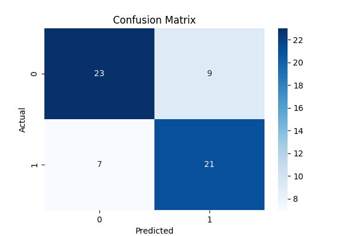
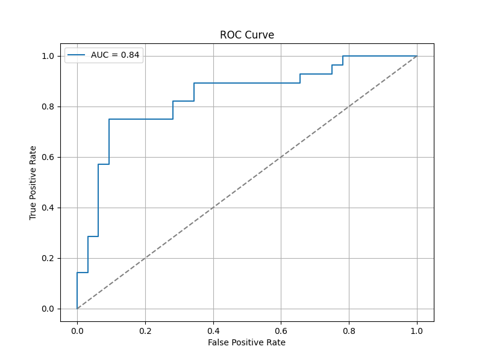
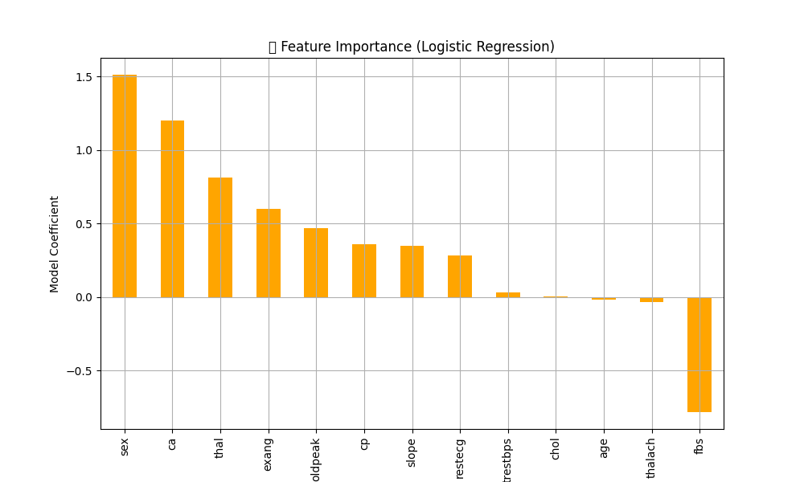

# ❤️ Heart Disease Risk Predictor

## Overview
Logistic regression model predicting cardiovascular risk using clinical data (Cleveland Clinic dataset).

## Key Visuals
| Analysis | Visualization | Insights |
|----------|--------------|----------|
| Prevalence |  | Class distribution balance |
| Feature Relationships |  | Strongest correlation: [X] |
| Model Performance |  | Accuracy: XX% |
| ROC Analysis |  | AUC: 0.XX |
| Key Predictors |  | Top 3: 1) X 2) Y 3) Z |

## Data Specs
- **Samples**: no. of patients
- **Features**: 13 clinical markers (age, BP, cholesterol, etc.)
- **Target**: Presence of heart disease (binary)

## Model Details
- **Algorithm**: Logistic Regression (+ regularization)
- **Validation**: train/test split
- **Metrics**: 
  - Precision
  - Recall
  - F1
